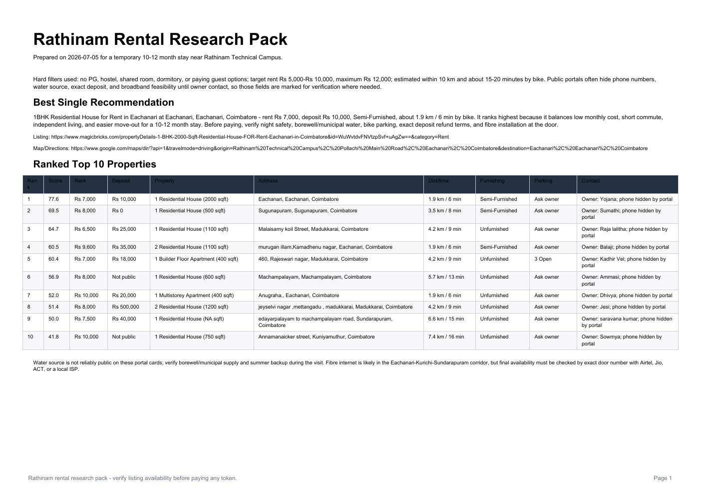

# Rental Research Report Generator

Python automation project that collects rental listing data, ranks nearby housing options, and generates decision-ready PDF/DOCX reports for a temporary student stay near Rathinam Technical Campus, Coimbatore.

## What It Does

- Searches public rental portals for nearby 1BHK/2BHK houses and flats.
- Filters out PGs, hostels, shared rooms, and listings outside the budget/commute range.
- Estimates commute distance, rent fit, furnishing value, deposit practicality, and overall suitability.
- Generates a ranked research pack with shortlist tables, monthly budget, first-month setup cost, verification checklist, and source links.
- Builds English and Tamil report versions for family review.

## Why This Project Matters

This is not just a PDF script. It shows practical developer skills employers and freelance clients care about:

- Web data extraction and parsing
- Data cleaning and scoring logic
- Report automation
- PDF/DOCX generation
- Localized multilingual output
- Real-world decision support

## Tech Stack

- Python
- ReportLab
- python-docx
- JSON
- Public web data parsing
- Noto Sans / Noto Sans Tamil fonts

## Preview

Generated report page preview:



## Project Structure

```text
.
|-- rental_research_pdf.py          # Fetches/parses listings and builds the main research pack
|-- english_report_builder.py       # Builds the English decision report
|-- tamil_report_v2.py              # Builds Tamil PDF, DOCX, Markdown, and WhatsApp summary outputs
|-- tamil_rental_report_builder.py  # Extended Tamil report builder
|-- job_opportunities.csv           # Curated internship/freelance opportunity tracker
|-- sample_data/                    # Offline sample data for demos and tests
|-- tests/                          # Unit tests for ranking and distance helpers
|-- assets/                         # Fonts used for multilingual PDF rendering
|-- output/                         # Generated reports and preview images
|-- docs/                           # Career positioning, resumes, and profile drafts
`-- portfolio/                      # Static portfolio website starter
```

## Setup

```bash
python -m venv .venv
.venv\Scripts\activate
pip install -r requirements.txt
```

## Run The Project

Build the rental research pack from live public listing pages:

```bash
python rental_research_pdf.py
```

Build a report from saved JSON data:

```bash
python rental_research_pdf.py --input-json sample_data/rental_listings_sample.json --pdf-name sample_rental_research_pack.pdf --no-summary
```

Build the English report:

```bash
python english_report_builder.py
```

Build Tamil report outputs:

```bash
python tamil_report_v2.py
```

Generated files are written under `output/`.

## Offline Demo

Use the sample data path when you want to show the project without relying on live rental portals:

```bash
python scripts/build_sample_report.py
```

This is a convenience wrapper around the CLI command above. It creates `output/pdf/sample_rental_research_pack.pdf` from `sample_data/rental_listings_sample.json`.

## CLI Options

```text
--input-json     Use an existing JSON payload with ranked/sources keys instead of fetching live portal data.
--pdf-name       Output PDF filename under output/pdf.
--summary-name   Output summary JSON filename under output/pdf. Use an empty value to skip writing a summary.
--no-summary     Skip writing a summary JSON file.
```

## Tests

Run the unit tests with the standard library test runner:

```bash
python -m unittest discover -s tests
```

The tests cover distance estimation and scoring behavior.

## Example Outputs

- `output/pdf/rathinam_rental_research_pack.pdf`
- `output/english_report/rathinam_house_report_english.pdf`
- `output/tamil_report/rathinam_house_report_tamil.pdf`
- `output/tamil_report/rathinam_house_report_tamil.docx`
- `output/tamil_report/whatsapp_one_page_summary_tamil.txt`

## Notes And Limitations

- Public listing portals often hide phone numbers, water source, exact deposit terms, and broadband availability.
- Rental listings change quickly, so generated reports should be treated as a shortlist for verification, not final truth.
- Always verify owner identity, agreement terms, street safety, water, parking, and deposit refund terms before paying any advance.
- The offline sample data is fictional and intended only for demo/testing.

## Suggested GitHub Description

`Python automation tool that ranks rental listings and generates bilingual PDF/DOCX decision reports with budgets, commute estimates, and verification checklists.`
